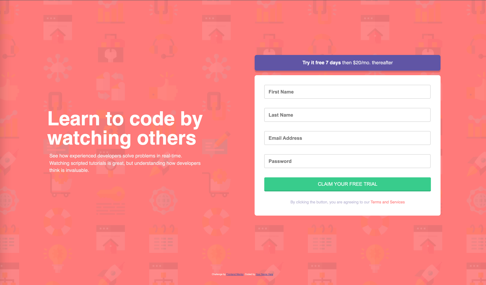

# Frontend Mentor - Intro component with sign up form solution

This is a solution to the [Intro component with sign up form challenge on Frontend Mentor](https://www.frontendmentor.io/challenges/intro-component-with-signup-form-5cf91bd49edda32581d28fd1). Frontend Mentor challenges help you improve your coding skills by building realistic projects. 

## Table of contents

- [Overview](#overview)
  - [The challenge](#the-challenge)
  - [Screenshot](#screenshot)
  - [Links](#links)
- [My process](#my-process)
  - [Built with](#built-with)
  - [What I learned](#what-i-learned)
  - [Continued development](#continued-development)
  - [Useful resources](#useful-resources)
- [Author](#author)
- [Acknowledgments](#acknowledgments)

## Overview

### The challenge

Users should be able to:

- View the optimal layout for the site depending on their device's screen size
- See hover states for all interactive elements on the page
- Receive an error message when the `form` is submitted if:
  - Any `input` field is empty. The message for this error should say *"[Field Name] cannot be empty"*
  - The email address is not formatted correctly (i.e. a correct email address should have this structure: `name@host.tld`). The message for this error should say *"Looks like this is not an email"*

### Screenshot

### Links

- Solution URL: [Github](https://github.com/BlakeEriks/frontend-mentor/tree/main/intro-component-with-signup-form-master)
- Live Site URL: [Repl](https://Frontend-Mentor-Intro-component.blakeeriks.repl.co)

## My process

### Built with

- Semantic HTML5 markup
- CSS custom properties
- jQuery
- Flexbox
- Mobile-first workflow

### What I learned

This challenge was a great opportunity for me to practice styling responsive web pages using media queries and a mobile-first design methodology.

## Author

- Website - [Blake Eriks](https://www.your-site.com)
- Frontend Mentor - [@blakeeriks](https://www.frontendmentor.io/profile/BlakeEriks)
- Twitter - [@be_lockay](https://twitter.com/be_lockay)

**Note: Delete this note and add/remove/edit lines above based on what links you'd like to share.**